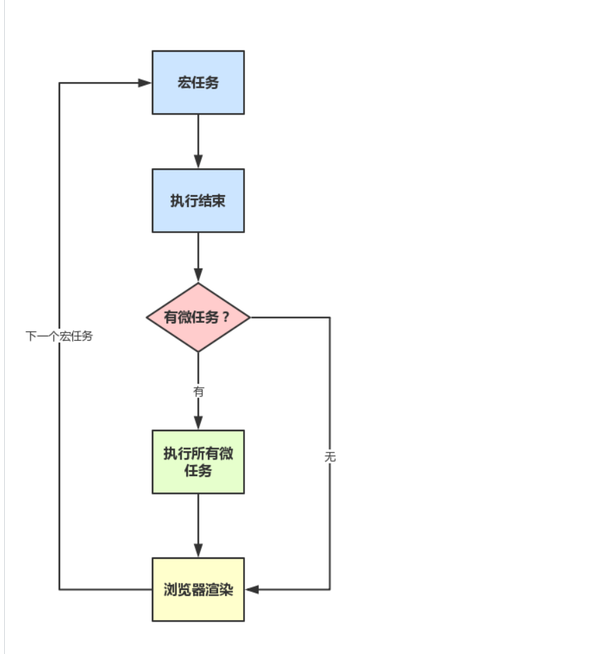

js是单线程的，处理任务是一件接着一件处理，所以如果一个任务需要处理很久的话，后面的任务就会被阻塞

所以js通过Event Loop事件循环的方式解决了这个问题

<!--more-->


## 概念
- stack（栈）：当代码函数执行时就会被压入栈中   先进后出
- queue（队列）：先进先出
- heap(堆)：存储obj对象

- 进程是cpu资源分配的最小单位（是能拥有资源和独立运行的最小单位）
- 线程是cpu调度的最小单位（线程是建立在进程的基础上的一次程序运行单位，一个进程中可以有多个线程）

tips

- 不同进程之间也可以通信，不过代价较大
- 现在，一般通用的叫法：单线程与多线程，都是指在一个进程内的单和多。（所以核心还是得属于一个进程才行）
### 对于浏览器
- 浏览器是多进程的

- 浏览器之所以能够运行，是因为系统给它的进程分配了资源（cpu、内存）
- 简单点理解，每打开一个Tab页，就相当于创建了一个独立的浏览器进程。
#### 浏览器都包含哪些进程？
知道了浏览器是多进程后，再来看看它到底包含哪些进程：（为了简化理解，仅列举主要进程）

1. Browser进程：浏览器的主进程（负责协调、主控），只有一个。作用有

    - 负责浏览器界面显示，与用户交互。如前进，后退等
    - 负责各个页面的管理，创建和销毁其他进程
    - 将Renderer进程得到的内存中的Bitmap，绘制到用户界面上
    - 网络资源的管理，下载等
2. 第三方插件进程：每种类型的插件对应一个进程，仅当使用该插件时才创建
3. GPU进程：最多一个，用于3D绘制等
4. 浏览器渲染进程（浏览器内核）（Renderer进程，内部是多线程的）：默认每个Tab页面一个进程，互不影响。主要作用为

    - 页面渲染，脚本执行，事件处理等

#### 重点是浏览器内核（渲染进程）
页面的渲染，JS的执行，事件的循环，都在这个进程内进行。接下来重点分析这个进程

**请牢记，浏览器的渲染进程是多线程的**
那么接下来看看它都包含了哪些线程（列举一些主要常驻线程）：

1. **GUI渲染线程**

- 负责渲染浏览器界面，解析HTML，CSS，构建DOM树和RenderObject树，布局和绘制等。
- 当界面需要重绘（Repaint）或由于某种操作引发回流(reflow)时，该线程就会执行
- 注意，**GUI渲染线程与JS引擎线程是互斥的，**，当JS引擎执行时GUI线程会被挂起（相当于被冻结了），GUI更新会被保存在一个队列中，**等到JS引擎空闲时立即被执行。，**
2. **JS引擎线程**

- 也称为JS内核，负责处理Javascript脚本程序。（例如V8引擎）
- JS引擎线程负责解析Javascript脚本，运行代码。
- JS引擎一直等待着任务队列中任务的到来，然后加以处理，浏览器无论什么时候都只有一个JS线程在运行JS程序
- 同样注意，，**GUI渲染线程与JS引擎线程是互斥的，**，所以如果JS执行的时间过长，这样就会造成页面的渲染不连贯，导致页面渲染加载阻塞。
3. **事件触发线程**

- 归属于浏览器而不是JS引擎，用来控制事件循环（可以理解，JS引擎自己都忙不过来，需要浏览器另开线程协助）
- 当JS引擎执行代码块如setTimeOut时（也可来自浏览器内核的其他线程,如鼠标点击、AJAX异步请求等），会将对应任务添加到事件线程中
- 当对应的事件符合触发条件被触发时，该线程会把事件添加到待处理队列的队尾，等待JS引擎的处理
- 注意，，**由于JS的单线程关系，所以这些待处理队列中的事件都得排队等待JS引擎处理（当JS引擎空闲时才会去执行），**

4. **定时触发器线程**

- 传说中的setInterval与setTimeout所在线程
- 浏览器定时计数器并不是由JavaScript引擎计数的,（因为JavaScript引擎是单线程的, 如果处于阻塞线程状态就会影响记计时的准确）
- 因此通过单独线程来计时并触发定时（计时完毕后，添加到事件队列中，等待JS引擎空闲后执行）
- 注意，W3C在HTML标准中规定，规定要求setTimeout中低于4ms的时间间隔算为4ms。
5. **异步http请求线程**

- 在XMLHttpRequest在连接后是通过浏览器新开一个线程请求
- 将检测到状态变更时，如果设置有回调函数，异步线程就产生状态变更事件，将这个回调再放入事件队列中。再由JavaScript引擎执行。
#### Browser进程和浏览器内核（Renderer进程）的通信过程


## 事件轮询机制
js引擎运行时，当代码开始运行的时候，会将代码，压入执行栈进行执行

执行完毕后就会弹出栈

当执行栈遇到异步时（添加点击事件和setTimeout），会交给[webapi](http://vimeo.com/96425312)去维护，而执行栈则继续执行后面的任务

webapi是浏览器自己实现的功能，这里专门维护事件。

执行栈，当执行栈空闲时，才会将事件队列里面的代码压入栈中执行，这就是Event Loop。

事件循环是通过任务队列的机制来进行协调的。一个 Event Loop 中，可以有一个或者多个任务队列(task queue)，一个任务队列便是一系列有序任务(task)的集合；
每个任务都有一个任务源(task source)，源自同一个任务源的 task 必须放到同一个任务队列，从不同源来的则被添加到不同队列。


## Event Loop进阶
Promise里有了一个一个新的概念：microtask

或者，进一步，JS中分为两种任务类型：macrotask和microtask，在ECMAScript中，microtask称为jobs，macrotask可称为task

它们的定义：

1. macrotask（又称之为宏任务），可以理解是每次执行栈执行的代码就是一个宏任务（包括每次从事件队列中获取一个事件回调并放到执行栈中执行）

- 每一个task会从头到尾将这个任务执行完毕，不会执行其它
- 浏览器为了能够使得JS内部task与DOM任务能够有序的执行，会在一个task执行结束后，在下一个 task 执行开始前，对页面进行重新渲染
```
（`task->渲染->task->...`）
```
2. microtask（又称为微任务），可以理解是在当前 task 执行结束后立即执行的任务

- 也就是说，在当前task任务后，下一个task之前，在渲染之前
- 所以它的响应速度相比setTimeout（setTimeout是task）会更快，因为无需等渲染
- 也就是说，在某一个macrotask执行完后，就会将在它执行期间产生的所有microtask都执行完毕（在渲染前）

3. 在上面场景会形成macrotask和microtask呢？

- macrotask：主代码块，setTimeout，setInterval等（可以看到，事件队列中的每一个事件都是一个macrotask）
- microtask：Promise，process.nextTick等

__补充：在node环境下，process.nextTick的优先级高于Promise__，也就是可以简单理解为：在宏任务结束后会先执行微任务队列中的nextTickQueue部分，然后才会执行微任务中的Promise部分。

可以看
https://segmentfault.com/q/1010000011914016

## 运行机制
在事件循环中，每进行一次循环操作称为 tick，每一次 tick 的任务处理模型是比较复杂的，但关键步骤如下：
1. 执行一个宏任务（栈中没有就从事件队列中获取）
2. 执行过程中如果遇到微任务，就将它添加到微任务的任务队列中
3. 宏任务执行完毕后，立即执行当前微任务队列中的所有微任务（依次执行）
4. 当前宏任务执行完毕，开始检查渲染，然后GUI线程接管渲染
5. 渲染完毕后，JS线程继续接管，开始下一个宏任务（从事件队列中获取）




#### 参考文献

[图解搞懂JavaScript引擎Event Loop](https://juejin.im/post/5a6309f76fb9a01cab2858b1?utm_source=gold_browser_extension#heading-11)

[从浏览器多进程到JS单线程，JS运行机制最全面的一次梳理](https://segmentfault.com/a/1190000012925872?utm_medium=hao.caibaojian.com&utm_source=hao.caibaojian.com&share_user=1030000000178452)

[来自一道异步笔试题](https://github.com/Advanced-Frontend/Daily-Interview-Question/issues/7)