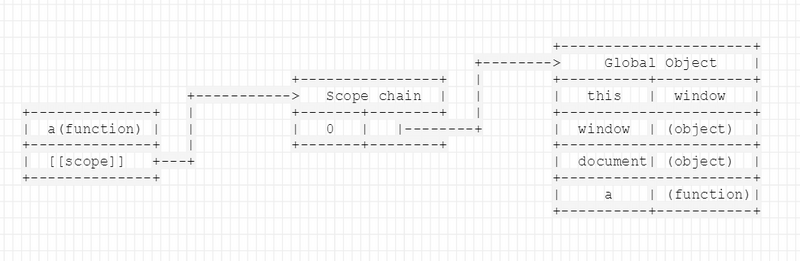
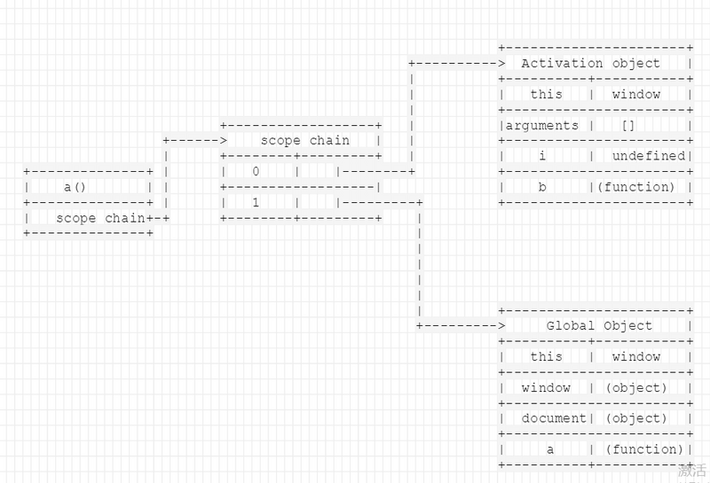

从一个问题引入

<!--more-->

```
<script>
    function Foo(){
        var i=0;
        return function(){
            console.log(i++);
        }
    }

    var f1=Foo();
    var f2=Foo();
    f1();//0
    f1();//1
    f2();//0
</script>
```

要理解上面的问题，首先要理解清楚几个概念：（[来自 闭包里的微观世界](https://segmentfault.com/a/1190000003021472)）

- 值类型

    声明一个值类型变量，编译器会在栈上分配一个空间，这个空间对应着该值的类型变量，空间存储的就是这个变量的值。 **存储在栈(stack)中的简单数据段，也就是说，它们的值直接存储在变量访问的位置**。

- 引用类型

    引用类型的实例分配在堆(heap)上，新建一个引用类型的实例，得到的变量值对应的是该实例的内存分配地址。存储在堆(heap)中的对象，也就是说，存储在变量中的值是一个指针(point)，其指向存储对象的位置。
```
//值类型
var a="xl";
var b=a;
a="XL";
console.log(b); //输出  "xl"

//引用类型
var a={name:"xl"};
var b=a;
a.name="XL";
console.log(b.name);//输出 "XL"
 
```
区别就是值类型变量是可以直接访问栈(stack)中的值：

在第一段代码中，将变量"a"赋值给"b"，相当于在stack中也为"b"开辟了一个存储其值的空间，与存储变量"a"的存储空间是相互独立的，因此修改"a"的值，不会影响到“b”的值。
在第二段代码中，"a","b"都获得的是对于存储在heap当中实例的引用，当“a”对其进行修改的时候，“b”的引用也会受到影响。
接下来的内容就是关于闭包的微观世界

```
function a(){
    var i=0;
    function b(){
        console.log(++i);
    }
    return b;
}
var c=a(); //函数a执行后返回函数b，并将函数b赋给c
c();//输出 1
```

本来这个地方变量i是定义在函数a中，并不能被函数a的外部所访问，但是这个地方因为在a中定义了一个函数b，函数b中有对变量i的引用，因此当b被a返回后，变量c获得了对函数a中函数b的引用，因此i不会被GC回收，而是存在内存当中。

当在一个函数a里面定义另外一个函数b，函数b有对函数a中变量的引用，当函数a执行并返回函数b，将b赋给变量c时，这样就存在相互之间的引用关系，并形成了大家经常见到的闭包

我们进一步的分析：这一部分的内容包含了作用域和作用域链部分的内容.

依然拿上面的例子来分析：

当定义函数a的时候，js解释器会将函数a的作用域链(scope chain)设置为定义a时所在的“环境”,如果a是一个全局函数，那么scope chain中只有window对象。

当执行函数a的时候，a会进入相应的执行环境(excution context).

在创建执行环境的过程中，首先会为a添加scope属性，即a的作用域，其值就为第一步的scope chain.即a.scope=a的作用域链。

然后执行环境会创建一个活动对象(call object).活动对象也是一个拥有属性的对象。但它不具有原型而且不能直接通过javascript代码访问。创建完活动对象后，把活动对象添加到a的作用域的最顶端，此时a的作用域链包含2个对象：a的活动对象和window对象。

下一步是在活动对象上添加一个arguments属性，它保存着调用a时所传递的参数。最后把所有函数a的形参以及定义的内部函数b添加到a的活动对象上。在这一步中，完成了函数b的定义，正如第一步，函数b的作用域链被设置为b被定义时所处的环境，即a的作用域
到此，整个函数a从定义到执行的过程就完成了。此时a返回函数b的引用给c，又函数b的作用域链包含了对函数a的活动对象的引用，也就是说b可以访问到a中定义的所有变量和函数。函数b被c引用，函数b又依赖函数的a,因此函数a在返回的时候不会被gc收回。

当函数b执行的时候，同样会按上述步骤一样。执行时b的作用域里包含了3个对象:{b的活动对象}、{a的活动对象}、{window对象}

下面用2张图来表示整个过程：

图一展示了函数a定义过程是如何创建作用域链的



图二展示了函数a执行过程产生的活动对象(call object)



在这其中有个非常重要的内容就是函数的作用域是在定义函数的时候就已经确定，而不是在执行的时候确定。

理解了上面这些，再回到开头的例子：

```
<script>
    function Foo(){
        var i=0;
        return function(){
            console.log(i++);
        }
    }

    var f1=Foo();
    var f2=Foo();
    f1();//0
    f1();//1
    f2();//0
</script>
```

f1指向的是内存空间中一个匿名函数，并且在内存里面引用没有释放（i的值一直存在）， **f2指向的是内存空间中另一个匿名函数，注意，这两个匿名函数在内存的不同位置，不是同一个，他们有各自的作用域；所以会是上述结果**。


```
function Foo(){
    var i=0;
    return function(){
        console.log(i++);
    }
}


var f1=Foo();
var f2=Foo();
console.log(f1 instanceof f2);//false
f1();//0
f1();//1
f2();//0

```